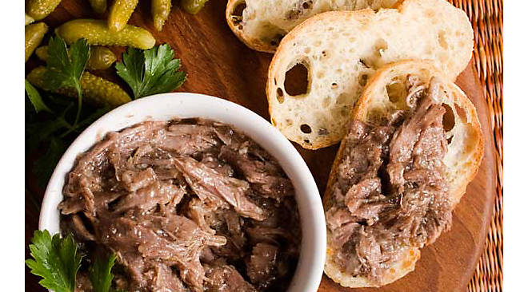

# Ande rilette - Rilette De Carnard Confit

__OBS!!__ Denne anderilette er tiltænkt til jul - kryderierne/urtene fra _dag 1_ kan udskiftes efter årstid.

## Ingredienser:
### Dag 1:
- 4 Andebryster
- 1 tsk lakridspulver
- 1 tsk tørret timian
- 1 tsk tørret oregano
- 1 tsk allehånde
- ½ tsk nelliker
- 1 stk kanel af 3 – 5 cm
- 1 tsk salt
- 1 tsk peber
- 1 øko appelsin, skal heraf

### Dag 2:
- 2 Laurbærblade
- Friske timianstilke
- 1 løg
- ~200 g smeltet andefedt. (Dette kan nogle gange købes ved den lokale slagter, og ofte i eks. Irma)
- Sylteglas
- Atamon eller (helst) cognac

## Fremgangsmåde:
### Dag 1:
Mort eller knus alle krydderierne og masser dem godt ind i andebrysterne. Læg dem i en lufttæt pose/vakumér til næste dag i køleskabet.

### Dag 2:
Skyl dine andebryst for tørmarinaden - den har nu gjort sit formål. Dup dem tørre med køkkenrulle og vakumér på ny. De skal nu dumpes i vandbadet på 75c i ~12 timer.

Nu lynkøler du kødet, enten i en skål med isvand eller koldt rindende vand, indtil du kan arbejde med kødet. Træk det fra hinanden med en gaffel eller køre det på en røremaskine. Tilsæt det smeltede andefedt. Der skal ca. bruges en halv del til en hel del andekød. Smag til sidste til med salt og peber og slut af med et lille skud cognac. Kom kødet på skoldede sylteglas, der er skyllet i atamon eller spiritus. Hæld lidt andefedt over riletten i glasset. Dette gør, at der dannes et naturligt låg. Stil det dernæst i køleskabet.

