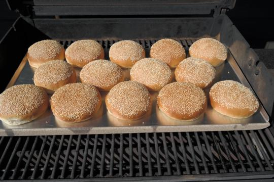

# Bløddej

### Ingredienser:
- 2 ½ dl. Vand eller mælk (evt. halv af hver)
- 1 æg
- 50 g. gær
- 45 g. sukker
- 5 g. salt
- 100 g. smør (stuetempereret)
- ~600 g. hvedemel

### Fremgangsmåde:
- Kom mælk/vand, æg og gær i en køkkenskål eller en køkkenmaskine og opløs gæren.
- Tilsæt sukker, salt og smør/margarine.
- Tilsæt melet - hold dog lidt tilbage, til at justerer konsistensen med.
- Ælt dejen i en køkkenskål, og tag dejen op når den er sammenhængende og ælt den videre på køkkenbordet.
- Æltes dejen i hånden er det en god ide, at krydsælte med begge hænder (skiftevis med højre og
- venstre hånd) – tryk med højre hånds håndrod ned i dejen samtidig med, at dejen presses væk fra
- kroppen, dejen vil under denne fremgangsmåde rulle – således, at der kommer spænd i dejen.
- Samme fremgangsmåde bruges med venstre hånd.

Når dejen føles spændstig, glat og ens i struktur er dejen æltet tilstrækkelig. Drys lidt mel i køkkenskålen og lad dejen hæve i skålen, tildækket med et stykke plastik i ca. 15 min.
Da der er ret go’ gang i bløddejen pga. gær og sukkermængden er 15 min. tilstrækkelig i hviletid

Dejen kan nu forarbejdes til det man har lyst til, fx:
Burgerboller 90 g. pr. stk.
Krydderboller 85 g. pr. stk.
Pølsebrød 60 g. pr. stk.

Straks dejen er færdig forarbejdet til det du ønsker at lave, stilles dejen, tildækket med plastik til hævning et så lunt sted som mulig i ca. 1 time. (dejen skal hæve til ca. db. størrelse)

Den ideelle bagetemperatur til bløddejen generelt er 210 - 220 grader lidt afhængig af ovn/grill. 
