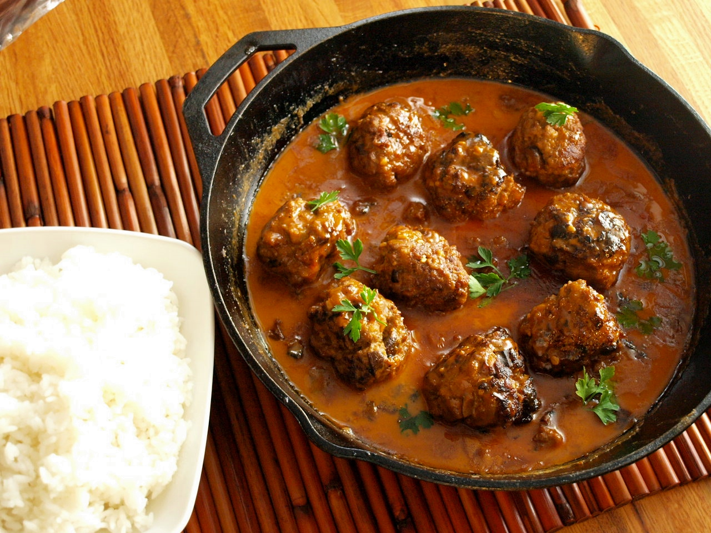

# Boller i karry

### Ingredienser:
- 200 g hakket kalv og svinekød
- 1 grønt æble
- 1 helt alm løg
- 1/4 fløde
- 3 dl let mælk
- 2 spsk rød karry
- 1 spsk madras karry
- salt
- peber
- 1 spsk tørret chili (efter behov)
- hvidløg efter behov
- 2 dl ris
- [mango chutney](mango_chutney.md)

### Fremgangsmåde
#### Fars:
- Sæt en gryde med vand og en tsk salt over blusset og lad det stille koge op.
- Rens dine løg og bønner hvis du har været heldig at finde nogle flotte.
- Skær det ene løg i grove tern. Det andet løg river du i farsen.
- Tilsæt 1 dl mælk i farsen og giv det to æg også - Kom dernæst et fed hvidløg i farsen, jeg river det altid så fint jeg kan.

- Smag til med salt og peber - eller gå efter din mavefornemmelse i forhold til krydring.
- Sørg for din kødfars ikke er alt for fast - men heller ikke for flydende! Du får meget mere luftige boller af at sørge for der er nok væde i din fars.
- Vandet burde nu være kogende. Varm din ske i det kogende vand og form nu dine boller med skéen og i din håndflade - til perfekte små boller.

Du skal ikke være bange for at vandet koger på nuværende tidspunkt, når du 'dumper' dine boller i vandet så sænkes temperaturen.

Når du er færdig med at forme dine boller og komme dem i vandet så skruer du ned på lavt blus.
Kom dine boller i en si og gem vandet fra processen. Det skal bruges til at dampe bønnerne med, og et par dl i sovsen.

#### Ris:
- 2 dl ris sættes over ved stærk varme, kom 2 dl vand ved og lad det koge tørt. 
- Tilsæt så 2 dl vand mere og sørg for risene kommer op og koge igen.
- Smæk et låg over dine ris når de koger på fuld skrald og lad dem trække færdig i dampen - Tag først låget af ved servering.

Dampen er lige så varm som det vand du koger risene i, du har lidt mere tid til at lave de andre ting færdige når dine ris står stille og ikke behøver opmærksomhed.

#### Karry sauce:
- Sæt en gryde over med olie
- Svits dine løg, hvidløg og æbler samt karry af ved højvarme
- Når det hele har taget farve så tilsætter du mælk og fløde og lader det simre stille.
- Kom salt, peber og chili i sovsen - Smag til!
 
Lad det hele koge stille ind og sæt det et koldt sted så du kan blende det sammen. __HUSK__ for guds skyld at din sauce skal være kold når du blender den, især i en food processor, det gør nas at få varm karry i hovedet.
Spæd gerne til hvis den er blevet lidt tyk med noget vand fra pocheringen af dine kødboller.

Kom det over varmen igen og tilsæt dine boller i sovsen når det har den rette konsistens.

---- 

Til sidst kan du sætte retten sammen, risene er færdige, bollerne i karryen er over varmen, bønnerne er dampede klar.
Anret med en god portion mango chutney.
