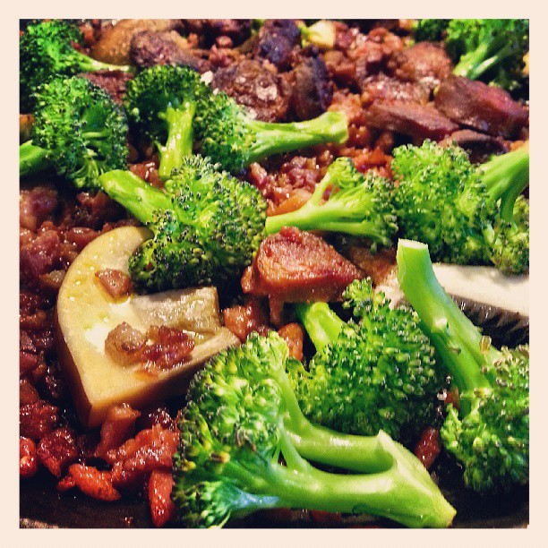

# Chorizo Biksemad 

## Ingredienser:
- 2 stk chorizo
- 200 gram hjorte pølse
- 400 gram røget bacon ( af med svær og det meste fedt)
- 10-12 kartofler
- 200 gram champignoner
- Broccoli
- 2 hele løg
- Forårsløg
- 100 gram kantareller
- Olie
- Smør
- Salt
- Peber

### Fremgangsmåde:
- Tænd din ovn på 200 grader.
- Sæt en gryde over og steg dine svampe ved lav varme i ca. 10 minutter og herefter ved god varme med en klat smør til de er brunede.
- Smæk en pande over på komfuret og sørg for at panden er godt varm og hæld så en god slat hjemmelavet chili olie (mikkels hjemmelavede chili olie) Kom chorizo på panden og steg pølsen sprød. Steg så din bacon og skru ned for varmen så baconen bliver gennemstegt men stadig får overflade. Kom dine løg på så snart baconen er ved at være halv færdig. Obs! Fordelen ved at stege chorizoen først og dernæst bacon så alle de andre ingredienser kan få smagen fra fedtet når du steger dem. Kom det hele i et stort ildfastfad og steg nu dine mundrette kartoffel tern på panden med lidt smør, tilføj dine broccoli buketter når dine kartofler er ved at være færdige, de skal ikke have så lang tid. Kom det hele i ovenen med dine rensede og skårede forårsløg i ovnen i 10 minutter og server gerne med spejl æg!

