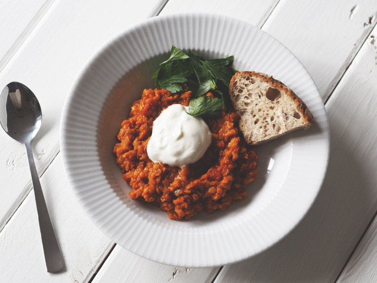

# Daal

Som alt indisk mad, kan indkøbssedlen måske godt umiddelbart se lidt uoverskuelig ud, men retten er faktisk virkeligt simpel at lave, og smager (også som alt andet indisk!) himmelsk. Sidst jeg skulle lave, havde jeg faktisk alt hjemme undtaget de hakkede tomater, så det er også en billig plantebaseret ret (hvis man springer over creme fraiche’n selvfølgeligt).

### Ingredienser:
- 3 dl røde linser
- Olivenolie
- 3 fed hvidløg (hakket groft)
- 2 løg (hakket groft)
- 1 dåser hakkede tomater
- 1 pk cherrytomater (halveret)
- 1 stk forårsløg (hakket i 3-4mm skiver)
- 1 cm ingefær (hakket fint)
- 1 rød peber (i julienne)
- 5 dl god grøntsagbouillon
- 1 tsk chiliflager/pulver/(el. 2 tsk cayenne)
- 3 tsk spidskommen
- 3 tsk god men stærk karry (el. 1 tsk karrypasta - juster chili herefter)
- 2 tsk garam masala
- 1 tsk stødt koriander
- 1 tsk korianderfrø
- 0,5 citron (saft heraf)
- Salt og peber

__Tilbehør:__  Creme fraishe og selvfølgeligt noget godt brød - oplagt ville det være naan.

### Fremgansmåde:
- Varm en god sjat olivenolie i en gryde og svits rød peber, løg og hvidløg godt af.
- Tilsæt de forskellige krydderier og lad det hele simre i et minutstid
- Tilsæt så hakkede tomater, linser og grøntsagsbouillon
- Lad det stå og simre i minimum en halv times tid - og meget gerne længere! Smag løbende til med citron, salt og peber og hvad du ellers kan synes mangler. Hvis konsistensen bliver for tyk, kan man roligt tilsætte vand. Til sidst før servering vendes de stadig rå forårsløg i retten
 
Anret i dyb tallerken eller skål, og garner med koriander/persille og creme fraiche
