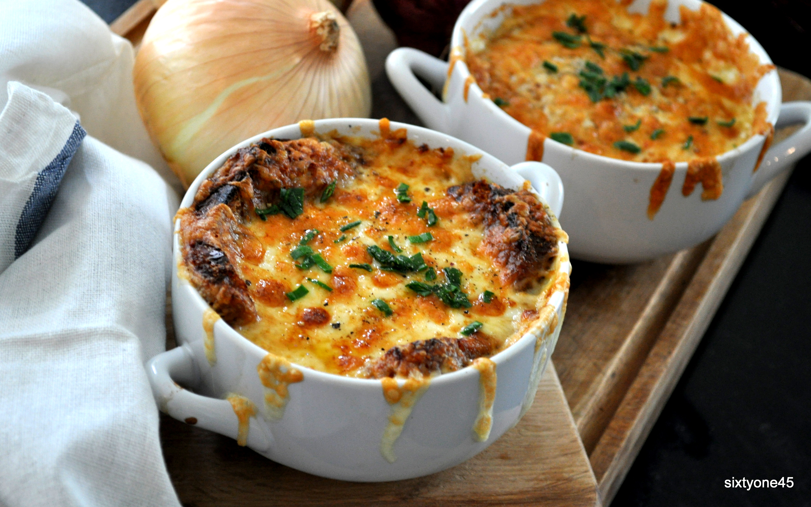

# Fransk løgsuppe

### Ingredienser:
- 1kg gule løg
- 250g skalotteløg
- 2 fed hvidløg
- 1,5l okseboullion 
- ca. 3dl hvidvin
- Sherryeddike
- Lyst brød (gerne dagsgammelt)
- 3-4dl revet ost ( fx. gruyere e.l.)
- Hvedemel

__Bind et klæde op med:__
- 3ish Laurbærblæde
- 10ish Peberkorn

### Fremgangsmåde:
- Snit alle dine løg - og brun dem godt af i en klat smør i en tykbundet gryde. Vær OBS på dette sagtens kan tage en times tid.
- Imens de karameliserer, kan du riste 6 skiver brød i ovnen ved 180 grader. De skal være tørre som tvebakker. 
- Tilsæt ca. 1,5-2 spsk hvedemel til dine nu brunede løg dine ved omrøring. 
- Tilsæt hvidvin, boullion og dit klæde med peberkorn og laurbærblade og lad simre i endnu halv times tid. 
- Smag til med sherryeddiken. 
- I en ildfast skål anretter du suppe med 1 skive brød og revet ost og placerer i midten af ovnen indtil osten er smeltet og gylden. 

