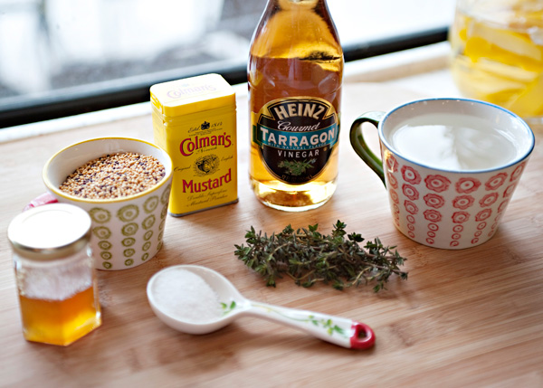

# Hjemmelavet Sennep

### Ingredienser:
- ¾dl gule sennepsfrø
- ½dl sennepspulver/mel
- 1.2dl vand
- 1dl æbleeddike
- 2spk brun farin
- 1 tsk salt
- 1 spsk gurkemeje

### Fremgangsmåde:
1. Bland sennepsfrø og sennepspulver.
2. Kog vand, eddike, farin, salt og gurkemeje op i en lille gryde, og hæld det over senneppen. 
3. Lad det trække ved stuetemperatur i et døgn. 
4. Blend, og vent 2 døgn.

For en mere speciel sennep prøv den [grove chipotle og øl-sennep fra Johns Hotdog Deli](ølsennep.md)
