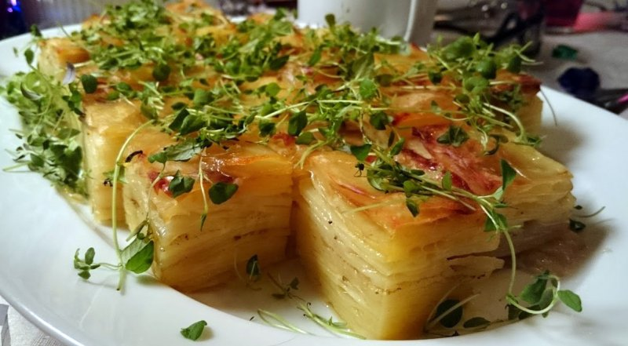

# Pommes Anna

### Ingredienser:
- En go' portion kartofler
- Rigeligt smeltet smør (bruger ~250g til et stort ildfast fad)
- Evt. lidt go' parmasan

### Fremgangsmåde:
1. Snit kartoflerne fint på en mandolin og vend dem i smeltet smør. Læg dem i lag i et fad – husk at krydre med salt og peber imellem lagene. Riv evt. lidt god parmesan mellem nogle af lagene.
2. Hæld evt. lidt ekstra smeltet smør over til sidst.
3. Bag pommes anna’en ved 175 grader i 45 min. under pres (sæt f.eks. et ildfast fad ovenpå), efterfulgt af 45 min. uden pres.
4. Skru evt. op for ovnen til sidst for at få en flot fylden overflade.
5. Skær pommes anna’en i pæne stykker til servering.

__For en sprødere udgave, brug samme teknik, men i stedet for det ildfaste fad, portions-anretter du dine anna i en stål-muffin-form. I stedet for at presse dem ned, tilberedes de i det første 45 min. 100% tildækket af sølvpapir, og derefter uden indtil de er gylden sprøde - 30-45 min.__
