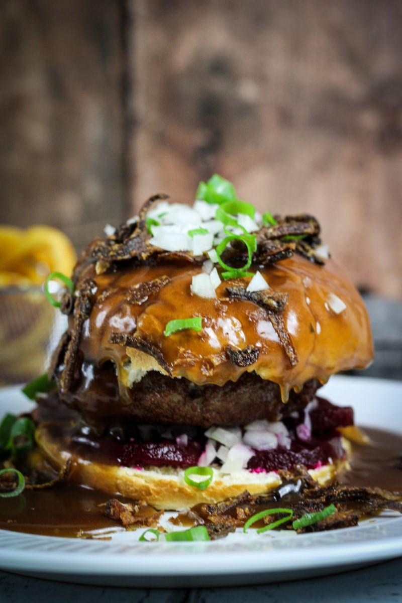

# Sous Vide Bøfsandwich

En egoopskrift på __*én*__ bøfsandwich. Det er lige mig!

### Ingredienser:
- 1 løg
- 300g lækkert oksekød
- 1 briochebolle
- 4 rødbeder
- 1 bdt Forårsløg

#### Sovsen
- God oksefond (ca. 2dl)
- 1 tsk Dijon
- 1 spsk Heinz
- 1 tsk Engelsk sauce.
- Kulør
- Salt/Peber
- 0.5dl 50% Creme Double

### Fremgangsmåde:
- Tænd dit bad på 57 grader celcius
- Kør dit kød på den groveste kødhakker du har - alternativt hak det med en skarp kniv, til du har noget der minder om hakket oksefars. Den behøves ikke at være superfint, især ikke fordi du _selvfølgeligt_ har købt noget godt kød.
- Form en bøf, skyd den med salt og peber og vacuumér den på _moist/wet_ indstillingen
- Når din Sous Vide er blevet 57 gader, plumber du den vacuumerede hakkedreng i, og imens den hygger sig i halvanden time i baljen laver du [ristede løg](Ristede_løg.md) og din sovs, så det passer med at bøffen er færdig når du er.
- I en høj pande varmer du fonden op og tilføjer sennep, ketchup og lidt engelsk sauce
- Når elementerne har lært hinanden at kende er det tid til at tilføje [Creme Fraiche](https://www.youtube.com/watch?v=RnD5tLp-W6A)
- Efter din sauce har småkogt i 10 minutters tid, smager du til med salt/peber, og det passer nu forhåbentligt med at din bøf er ved klar - ud af vacuumeringen og dup den tør, før du smider den på panden i sovsen, hvor den for lov at lægge og hygge i 10-15 minutter på lav varme, imens din ovn bliver varm og dit brød bliver det samme. 

Så er der kun tilbage at snitte de rå løg og forårsløg, og så ellers bare samlet herlighederne. 
