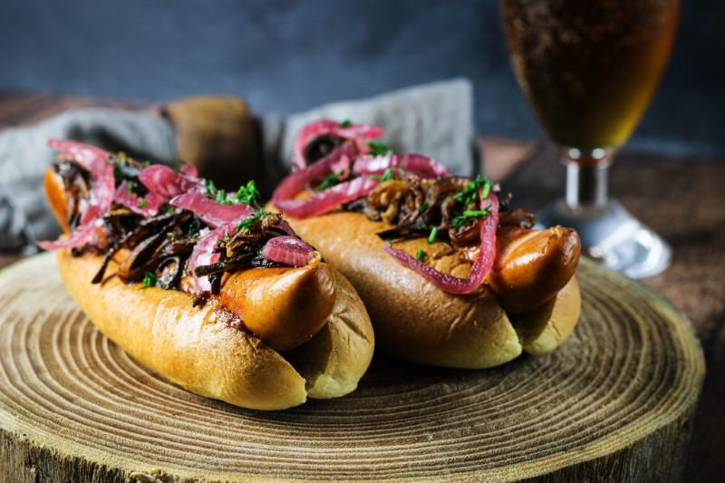

# Sous Vide Hot Dog

Jeg har valgt at bruge en _to-i-en'er_ i form af Lane's Southbound BBQ sauce, da det ud over at være en klassisk BBQ sauce, også er en senneps BBQ sauce. Er du ikke til BBQ-sauce i din hot dog, brug da ketchup og tjek evt. opskriftene ud på hhv. [klassisk sennep](Hjemmelavet_sennep.md) eller [Hot Dog John's opskrift på sennep på Mikkeller øl](ølsennep.md). 

### Ingredienser:
- 4 slagter pølser 
- 4 brød (brioche el. [Bløddej](bløddej.md))
- [Lane's Southbound BBQ Sauce](https://chilihouse.dk/shop/lanes-southbound-bbq-sauce/)
- [Ristede løg](Ristede_løg.md) 
- [Ølsyltede rødløg](Ølsyltede_rødløg.md)
- 1 bdt. purløg

### Fremgangsmåde:
- Tænd din Sous Vide på 65 grader celisus. Når Sous Viden er varm, så smid dine pølser i. Giv dem en time i badet.
- I denne time kan du bruge tiden på at lave [ristede løg](Ristede_løg.md).
- Når der er ti minutter tilbage på Sous Viden, forvarmer du ovnen. ~200 grader. 
- Når det er fem minutter tilbage, forvarmer du den tungeste pande du på medium/høj varme.
- Når vandbadet bipper, kommer vi hotdog brødet i ovnen, og pølserne skal nu ud af vacuum posen og duppes tørre, og herefter på den varme tørre pande i 1-2 minutter på hver side - kun nok til at de får lidt farve.
- Til sidst napper vi brødende ud af ovnen og samler hotdog'en.
