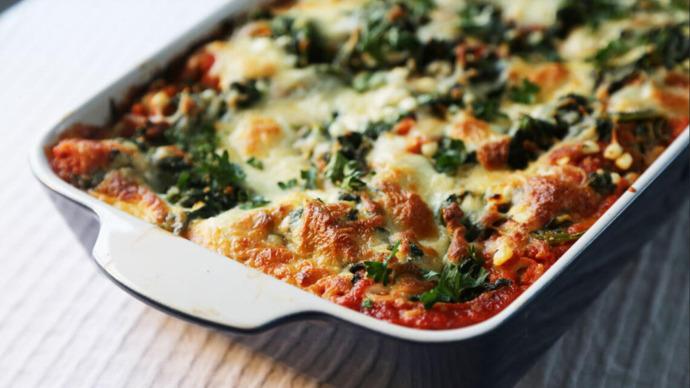

# Vegetarlassagne med spinat

Her får du en nem, overskuelig og sund lasagne med masser af smag. Princippet er enkelt: Lasagnen laves af lag med skiftevis kraftig tomatsovs, lasagneplader og en spinat og osteblanding.

### Ingredienser:
#### Tomatsovs
- 1 løg
- 2 fed hvidløg
- 1 dåse tomatpuré
- 2 gulerødder
- 2 dåser flåede tomater
- Olie til stegning
- Salt og peber 

#### Spinatfyld
- 2 poser frossen, helbladet spinat (450 gram per pose)
- (Du kan også bruge frisk spinat, men det kræver en hel del!)
- Salt efter behov
- 500 g hytteost eller ricotta 
---
- 1/2 pakke lasagneplader
- 250 g revet ost til topping
- (mozzarella)
- En pakke frisk mozzarella 

### Fremgangsmåde:
- Begynd med at tø din spinat op, hvis den stadig er frossen. Du kan tø den op i en mikroovn eller i en gryde sat på lavt blus. Tilføj en teske salt til spinaten.
- Imens spinaten tør op, laver du din tomatsovs:
- Hak løget fint og steg det i en god klat olie. Rapsolie er ofte lidt bedre at stege i end olivenolie. Hak hvidløgene fint og put dem i gryden. Løgene skal steges godt, men de må ikke branke og blive sorte.
- Riv gulerødderne fint på et rivejern og hæld dem ned til løgene. Lad det stege lidt.
 - Tilføj nu tomatpure og lad det stege med.
- Når blandingen er godt varm, hælder du de flåede tomater i.
- Lad sovsen simre i minimum 20 minutter.
- Imens sovsen simrer, gør du dit spinatfyld klar. Når spinaten er optøet, skal du have væsken ud af. Du vil nemlig ikke have en vandet lasagne! Den mest effektive måde at fjerne vandet er at lægge spinaten i et rent viskestykke. Rul spinaten godt ind i viskestykket og vrid væsken ud!
- Hæld den ’tørre’ spinat i en skål og bland ost og lidt salt i. Ricottaost smager en lille tand bedre, men hytteost er ofte lidt nemmere at få fat på.
- Nu er det snart tid til at samle lasagne, men først skal du smage din tomatsovs til. Blend den evt. lidt med en stavblender, så bliver lasagnen lidt mere ensartet i strukturen.
- Fint et fad fx 20 X 30 cm og smør det i bunden med lidt smør eller olie. Fordel et tynd lag tomatsovs ud over bunden. Fordel spinatblandingen i et tynd lag over sovsen og slut af med et lag lasagneplader.
- Sådan fortsætter du, indtil du ikke har mere fyld tilbage. Nå du har lagt det sidste lag tomatsovs og spinatfyld på, topper du lasagne med revet ost og klatter af frisk mozzarella.
- Bag i ovnen på 180 grader varmluft i cirka 35 minutter. Hold øje med, at osten bliver gratineret, uden at overfladen bliver brændt.
