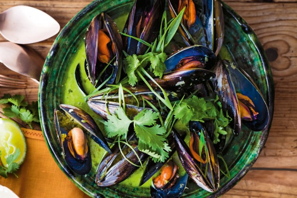

# Thai Muslinger

### Ingredienser:
- 1 kg friske blåmuslinger
- 1 løg
- 1 rød chilli
- ~2cm ingefær
- 1 fed hvidløg
- 1 stang citrongræs
- 1 sjat olie
- 400 ml kokus mælk
- 1 sjat soya
- 1 sjat fiske sauce
- 1 håndfuld koriander
- 1 lime

### Fremgangsmåde:
- Soignér dine muslinger- smid de åbne og dem som ikke lukker når man giver dem et lille ‘dask’, ud. Fjern alt deres “skæg”.
- Pil og hak din løg+hvidløg, og steg af i olie, og tilføj herefter chili, citrongræs og ingefær.
- Tilføj dine muslinger og halvdelen af din kokusmælk. Put låg på og lad simre imens du hakker lidt koriander groft. (indtil muslingerne er åbne).
- Fjern muslingerne fra gryden, og tilføj nu resten af kokusmælken, soya sauce, fiskesauce, saft fra lime og dit friskhakkede koriander. Lad det reducere i nogle minutter.
- Fordel lidt muslinger i to skåle og hæld saucer over. Top af med frisk koriander.

Selvom det er et thai take på klassisk dampede muslinger, kan de stadig sagtens serveres med [Tripple Cooked Fries](Tripple_cooked_fries.md) som en thai '[Moules Frites](Moules_frites.md)'

