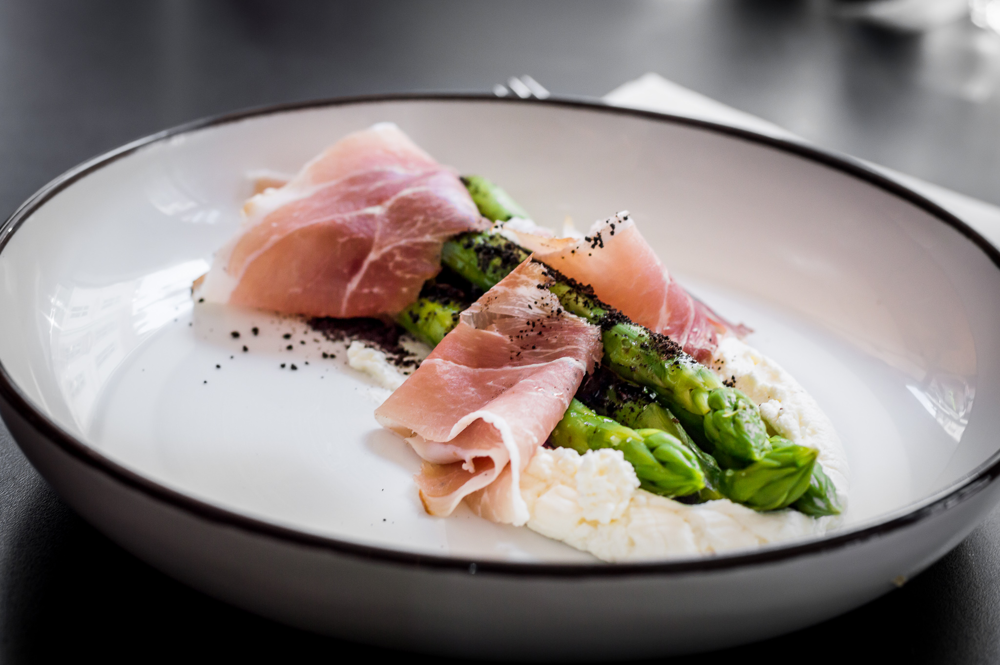

# Grønne asparges med rygeostcreme og skagensskinke

### Ingredienser (2 pers.)
- 8 grønne asparges
- [Rygeostcreme](rygeostcreme.md)
- 125 g. skagensskinke
- 1 citron

### Fremgangsmåde:
- Soignér dine asparges, og knæk bunden af ved det naturlige knæk. 
- Blancher nu dine asparges i 2 - max 3 minutter minutter efter størrelse.

Anret nu din rygeostcreme på din tallerken, så asparges, og til sidst skinken. Drys med lidt salt, oliveolie, og citronskal, server.

Kan evt. drysses med [maltcrumble](maltcrumble.md), hvis du føler dig overskudsagtig. 
