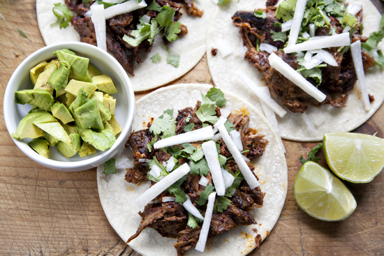

# Lamb Babacoa (Slow cooker)

__Babacoa er en oldgammel tilberedningsteknik fra carribbien hvor man man pakkede store stykker kød (gerne lam) ind i bananblade, og langtidstilberedte dem på gløder, og 100% tildækket af fx. sand/jord. Det er den teknik der senere har udviklet sig til en vaskeægte BBQ, hvorfra navnet selvfølgeligt også stammer fra. Det giver, ligesom når du laver pulled pork på weberen, et meget mørt og saftigt stykke kød, med et goddaw af smag. Ud over at retten i sig selv tager noget tid at tilberede (ikke at forberede), skal man også på jagt efter chipotle i adobolage - jeg plejer at bestille forud på chilihouse.dk__

### Ingredienser:
- ~2kg. kød-klump efter eget ønske. (jeg har prøvet med okseskulder og lammebov - begge virkeligt gode resultater)
- 1 ds. chipolte i adobolage (~4-500ml/g)
- friske chili (100% efter egen smag og temperement)
- 2-3 løg
- 1 god håndfuld koriander
- Div. krydderier (jeg er fan af paprika, chili, spidskommen, cayennepeber)
- 0,5 dl. eddike
- 1 l. bouillon
- saften fra 2-3 limes

### Fremgangsmåde:
Soigner dit kødemne, og skær det i 2-3 store chunks der er passende din slowcooker/römertopf, og put dem deri. 
Hak løg, chili, chipolte, (halvdelen af) korianderen og tilfør det sammen med de øvrige ingredienser i slowcookeren og start den på low i 6-7-8 timer, alt efter hvor sulten du er, eller travlt du har. Bouillonen skal kun lige dække kødet.

Når tiden er gået, står du klar med en 225 grader varm ovn. Overfør dine kødstykker til et ildfast fad, træk kødet fra hinanden med 2 gafler, strø det med lidt krydderi, påfør noget af lagen fra slowcookeren og slut af med et tyndt(!!!) lag sukker, bland og sæt i ovnen 5-10 minutter. 

Serveres evt. som taco med masser af lime og koriander, og syltede rødløg.
