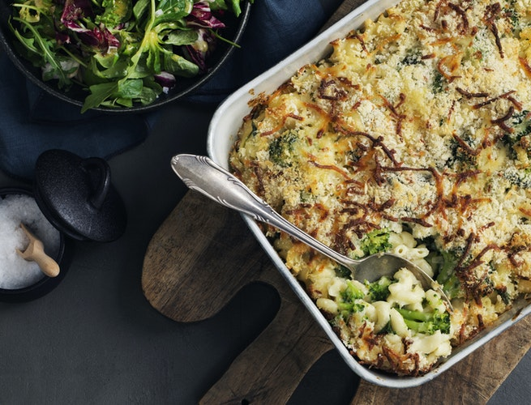

# Mac'N'Cheese (med spinat og broccoli) 

### Ingredienser:
- 300g pasta (f.eks. makaroni eller suppehorn)
- 200g broccoli
- 1 løg
- 20g smør
- 2 spsk. hvedemel
- 5 dl sødmælk
- 125g frisk babyspinat
- 120g revet mozzarellaost
- salt og peber
- 30g rasp

### Fremgangsmåde:
1. Kog pastaen i en stor gryde med letsaltet vand efter pakkens anvisning.
2. Skyl broccoli, og skær den i små buketter. Lad broccolibuketterne koge sammen med pastaen de sidste 2 minutter af pastaens kogetid. Sigt vandet fra, og lad pasta og broccoli dryppe godt af.
3. Pil løget, og hak det fint. Smelt smørret i en gryde, og steg løget i 5 minutter. Tilsæt hvedemel, og steg videre i 2-3 minutter under omrøring, til melet bliver let gyldent og dufter. Tilsæt sødmælk lidt ad gangen under konstant piskning, og kog saucen i nogle minutter, til den tykner.
4. Skyl spinat, og rør spinat og halvdelen af osten i saucen, til osten smelter. Smag saucen til med salt og peber.
5. Tænd ovnen på 200°. Vend pasta og broccoli sammen med saucen, og hæld blandingen i et ovnfad. Bland rasp og resten af osten sammen, og drys det over retten.
6. Bag retten i ovnen i 20-25 minutter, til overfladen er gylden, og saucen bobler.
