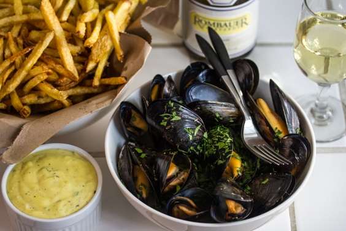

# Moules Frites

Moules Frites (“Mussels And Chips”) e for mange en lidt spøjs sammensætning, men delikat fransk klassiker ikke desto mindre. 

Lav dine pommes frites som du foretrækker/plejer. Jeg bruger ovennævnte opskrift på tripple cooked fordi…. Det er bare federe..

### Ingredienser:
- 1½-2 kg blåmuslinger (regn med ~500g./pers)
- 1 skalotteløg
- 3 fed hvidløg
- 1 spsk olivenolie
- 3 dl hvidvin
- 2 dl fløde
- En stor håndfuld bredbladet persille
- Salt & peber

Pommes frites (se [opskrift](tripple_cooked_fries.md))

### Fremgangsmåde:
- Skyl og rens muslingerne grundigt. De muslinger, som ikke er lukket - eller som ikke lukker sig efter et par bank på køkkenbordet - kasseres med det samme.
- Hak løg og hvidløg og brun dem i olivenolie i en stor gryde.
- Kom muslinger, persille og hvidvin i gryden og varm op under låg. Sving gryden lidt så alle muslingerne får varme.
- Muslingerne er færdige, når de er åbne - efter ca. 5-8 minutter. De, som ikke åbner sig under tilberedningen, kasseres.
- Tag muslingerne op og pak dem ind så de holder varmen.
- Lad dernæst saucen koge ind så den får en tykkere konsistens. Tilsæt herefter fløde og varm op. Smag til med salt og peber. Hæld saucen over muslingerne og server.

Server pommes frites og muslinger for sig. Velbekomme.
