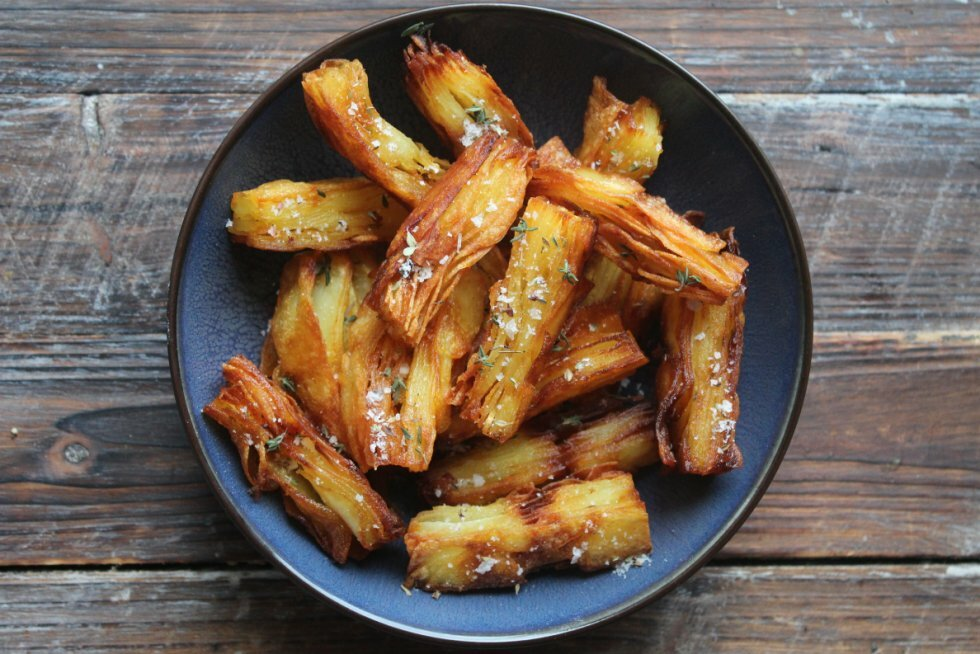

# Pommes Anna Fritter

Du kender de klassiske Pommes Anna, hvor man skærer tynde skiver kartoffel ud og vender dem i smør og lægger dem i lag som en lasagne - herefter bages de, afkøles og varmes op igen, når man skal servere dem.

Men har du tænkt på, at man kan lave dem til fritter?

__Portioner:__ 4
__Tilberedning:__ 1t 30m
__Tid i alt:__ 3t 40m

### Ingredienser:
- 600 gram mellemstore kartofler
- 60 gram smør
- 1 spsk. friske krydderurter, kan undlades (estragon, timian, oregano, etc.)
- 1 tsk salt
- 500 ml solsikkeolie, til stegning

### Fremgangsmåde:
- Forvarm ovnen på 180 grader. Start med at smelte dit smør i en gryde - det skal blot lige smelte, men forblive lunkent.
- Herefter skal du have skåret dine kartofler helt tynde - her vil jeg anbefale et mandolinjern for at få den bedste effekt. Det gør, at du kan få helt tynde lag, de hænger bedre sammen og så er det meget nemmere at at skære dem ud. Skræl kartoflerne, skær dem tynde og smid dem i en skål.
- Hæld den smeltede smør over kartoffelskiverne og vend dem rundt uden at knække dem.
- Smør et lille firkantet fad (jeg brugte et af størrelsen 15x20 cm og 6 cm i højden) med lidt af smørret og begynd at lægge kartoflerne i lag, så de dækker bunden - fortsæt med flere og flere lag, indtil du har brugt alle kartoflerne. Jeg fik ca. en højde på 7-8 lag kartofler - det er meget passende i forhold til tykkelsen og størrelsen på en pommes frites i det endelige resultat.
- Dæk dem med et lag stanniol og læg et mindre skål, en gryde eller andet der kan tynge dem ned, så de holder formen og klemmes sammen - stil dem i ovnen og bag dem i 1 time og 20 minutter. Tag dem herefter ud og lad dem køle af.
- Når de er kølet godt af, sættes de i køleskabet i minimum en times tid eller to.
- Efter afkøling lirkes kartoffelmassen forsigtigt ud af formen og lægges på et skærebræt. Skær nu aflange firkanter ud til fritter - læg dem på et fad og stil dem i fryseren i 45 minutter.
- Varm olien op i en gryde til ca. 160-170 grader - den skal ikke have fuld knald på fra starten af, da man ellers risikerer at få alt for mørke kanter og helt blød midte.
- Tag 4-5 fritter op af fryseren ad gangen og steg dem - lad resten blive, da de bedre holder på formen, hvis de er let frosne. Steg dem gyldne og sprøde i olien i ca. 4-5 minutter - lad dem dryppe af på et stykke køkkenrulle, drys med salt og servér straks! De kan som minimum holde sig sprøde i 30-60 minutter efterfølgende.

