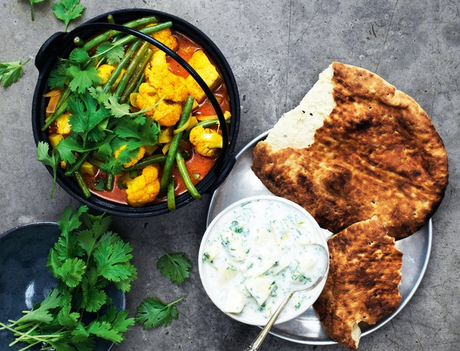

# *Chick free* Veggie Masala

### Ingredienser:
- 2 løg
- 3 fed hvidløg
- 1 frisk grøn chili
- 15 g smør til stegning
- 2 spsk. garam masala-pasta
- 2 bagekartofler
- 2 tomater
- 3 dl grøntsagsbouillon
- 1 dåse kokosmælk
- 1 blomkål
- 150 g grønne bønner
- 1 limefrugt
- salt peber
- 1 håndfuld frisk koriander

__Bemærk:__ Garam masala-pasta kan købes på glas i velassorterede supermarkeder. Alternativt kan du bruge andre tørrede indiske krydderier, fx garam masala.

#### Riata
- 1 mango
- 1 håndfuld frisk koriander
- 1 håndfuld frisk mynte
- 2 dl yoghurt naturel 3,5 %
- salt peber
- 1 tsk. stødt koriander

### Fremgangsmåde:
- Pil og hak løg og hvidløg. Rens og snit chilien. Steg det hele i smør i en gryde. Lad masala-pastaen stege med, til den begynder at dufte.
- Skræl kartoflerne. Skyl tomaterne. Skær begge dele i små tern, og lad det stege kort med i gryden.
- Hæld bouillon og kokosmælk ved, og lad det simre i 15 minutter.
- Skyl blomkålen, og skær den i buketter. Skyl og nip bønnerne. Lad blomkål og bønner koge med i gryden under låg i ca. 10 minutter, til de er møre, men stadig har bid.
- Pres saften af limefrugten. Smag retten til med salt, peber og limesaft. Top med plukket koriander.

##### Riata
- Skær skrællen af mangoen, og skær mangokødet i små tern. Hak krydderurterne.
- Bland mango og krydderurter med yoghurt, og smag til med salt, peber og stødt koriander. Servér raitaen til masalaen med lunede naanbrød til.
