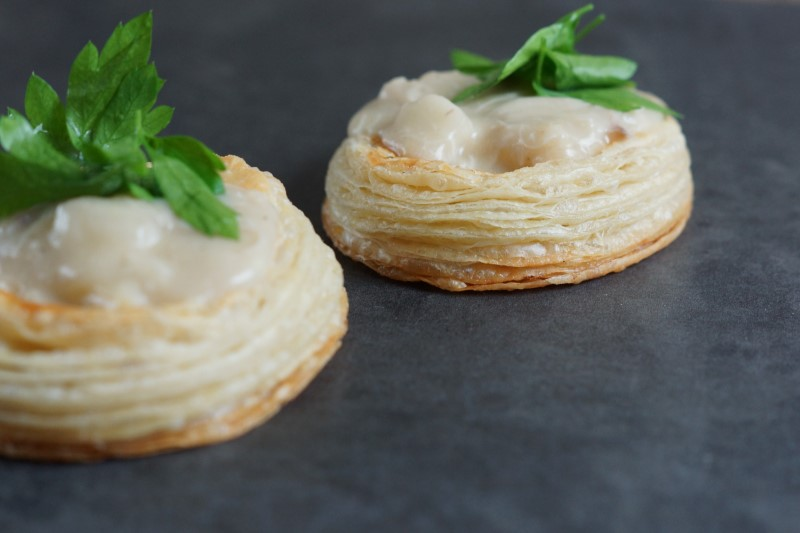

# Vol au Vents

__Forberedelsestid__: 4 timer
__Tilberedelsestid__: 20 minutter
__Tid i alt__: 4 timer, 20 minutter

### Ingredienser:
- 4 dl Hvedemel
- 1 1⁄2 dl Vand (koldt)
- 1⁄4 tsk Salt
- 2 spsk Eddike
- 50 g Smør (stuetempereret/blødt)
- 200 g Smør (koldt - til rulningen)
- 1 Æg (til penslingen)

### Fremgangsmåde:
- Kom vand, salt, eddike, mel og det bløde smør i en røreskål, og kør den med en dejkrog, til den er samlet og smidig.
- Sæt den på køl i 30-60 min.
- Drys mel på køkkenbordet og rul dejen til en rektangel på en cirka-tykkelse á ~1cm.
- Skær tynde skiver af det kolde smør og fordel det på ⅔-del af dejen.
- Fold nu dejen i 3 lag
- Sæt den på køl i 15 minutter - smørret må ikke blive for varmt.
- Rul dejen ud igen, til en rektangel á ~1cm tykkelse, og gentag processen med smørret, foldingen og på køl i 15 min.
- Gentag processen mindst 5 gange (og gerne flere!!)
- Sidste gang sættes dejen på køl i en times tid.
- Rul nu dejen ud i en halv cm tykkelse, og du kan med fordel nøjes med at starte med halvdelen af dejen.
- Brug udstikkere af ~8-9cm til at udforme de fine runde _vol au vents_.
- Brug en mindre udstikker (6-7cm) til at trykke ~½-⅓ ned - vær forsig, du må ikke trykke hele vejen igennem.
- Kom dine _vents_ på en bageplade og pensl nu overfladerne (ikke siderne)
- Bages i almindelig ovn i ~20 minutter ved 200grader.

Når de er kølet lidt af, fjerner du indholdet fra den inderste ring, vi stak ud, så der er plads til fyld - eks denne fra [tartelet opskrift](tarteletter.md) fra Madet Mere.
