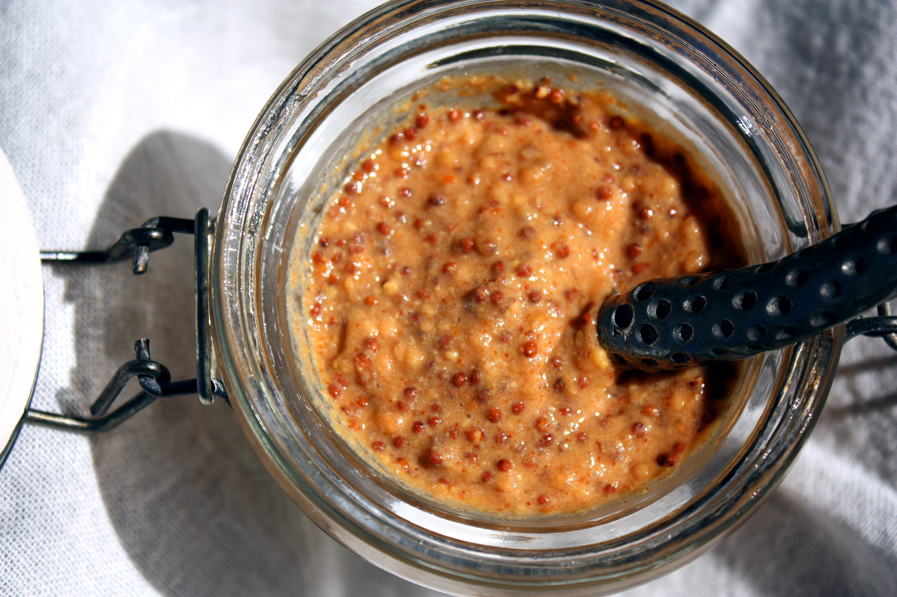

# Chipotle/Øl sennep

Opskriften er fra Johns Hotdog Deli

### Ingredienser:
- 1 fl. god øl (John bruger Mikkeller)
- 3 dl. eddike
- 175g gule sennepsfrø
- 125g gul sennepsmel
- 20g salt
- 75g sukker
- 1 ds chipolte 

### Fremgangsmåde
- Blend hele indholdet af chipoltedåsen, og kom det i en gryde med øl, eddike, salt og sukker, hvor du lader massen koge op, og tager den af varmen igen.
- Tilsæt de gule sennepsfrø og lad det trække i ~15 minutter
- Rør nu sennepsmelen godt ind i massen, og put på beholder, og lad trække i 7 dage.

[For almindelig sennep se her](Hjemmelavet_sennep.md)
